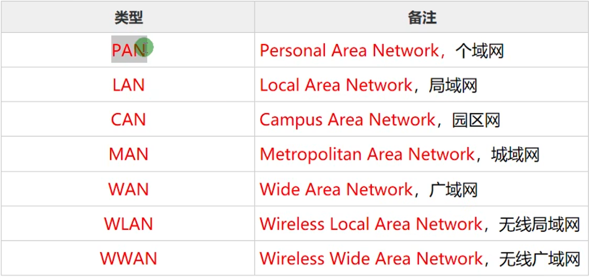
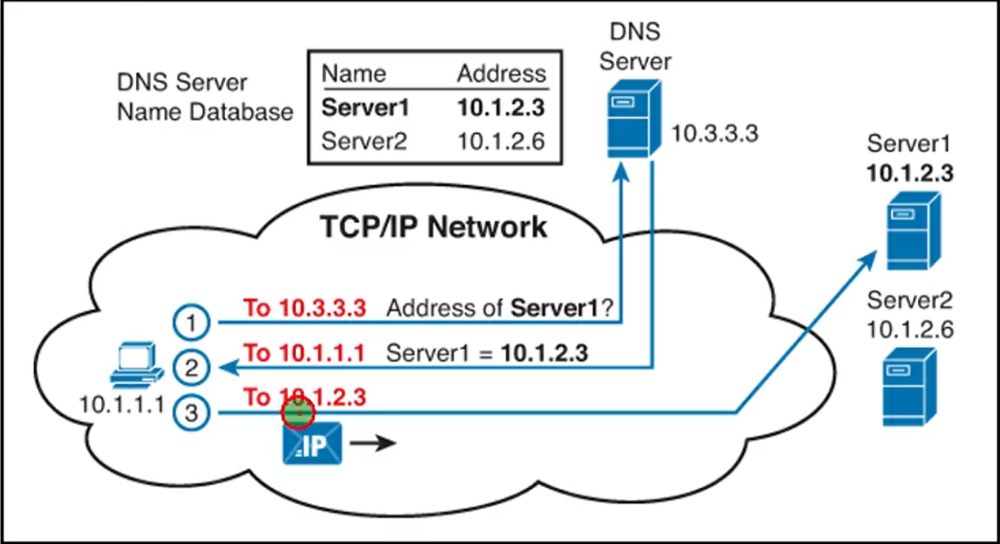
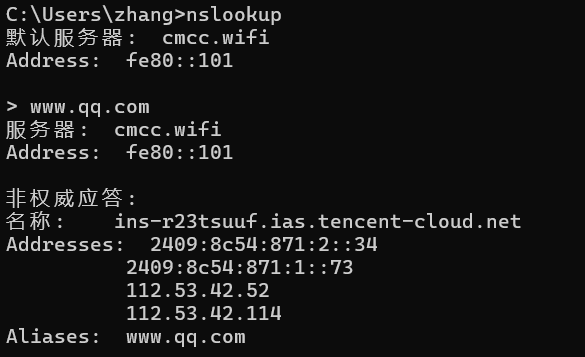
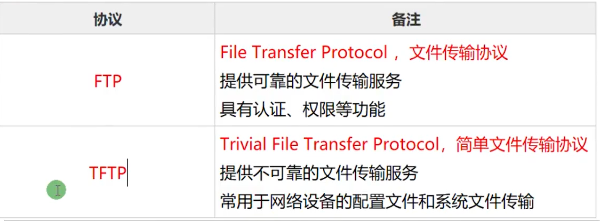
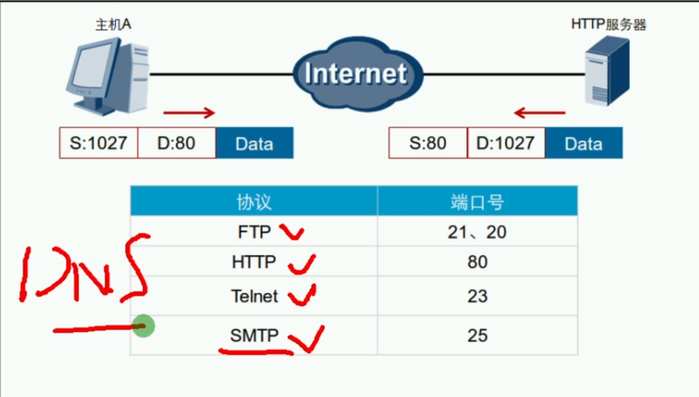
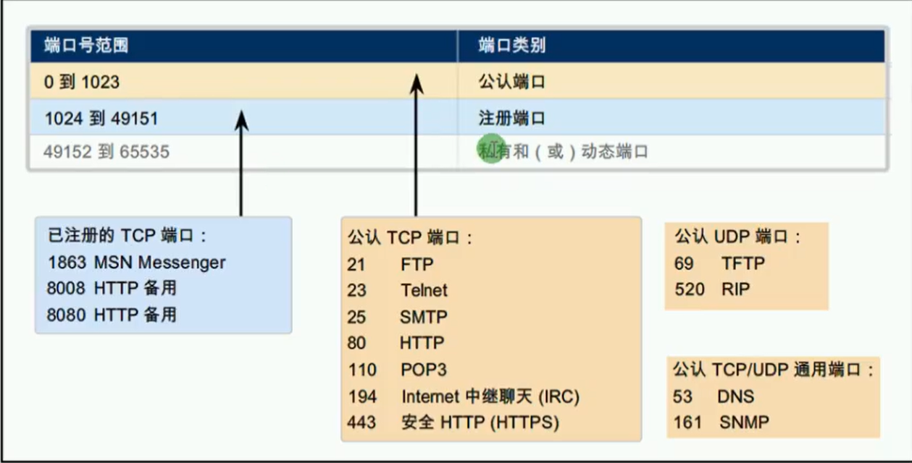
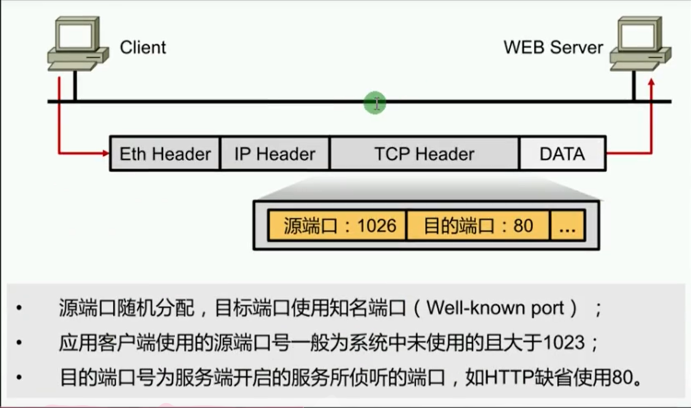
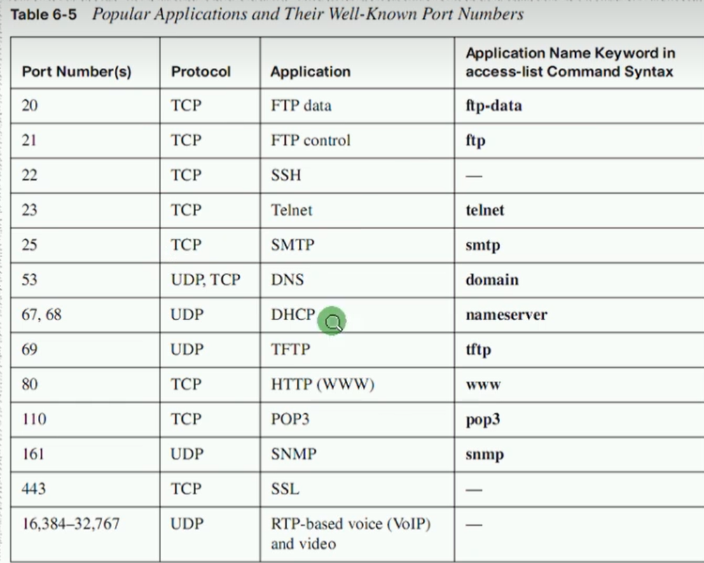

# 网络基础

## 基本概念

- 硬件方面：通过介质将网络设备与终端连接起来
- 软件方面：操作系统，应用软件，应用程序互相通信
- 实现资源共享、信息传递

> **网络是由节点和连线构成的图，表示研究诸对象及其相互联系。**‌在计算机领域中，网络是通过物理链路将各个孤立的工作站或主机相连在一起，组成数据链路，从而达到资源共享和通信的目的。‌

## 网络类型

由覆盖范围不同，组网技术不同（主要是体现在O最下面两层，物理层和数据链路层）

<<<<<<< HEAD
> tip: 任何网络两层之上都是相同的
=======
> tip: 任何网络两层之上都是相同的
>>>>>>> 5d3ed289c57b87113e61fc4a200209b1bf2b595a

> 举例：
>
> ​	PAN：蓝牙，电视机遥控器等等
>

## OSI七层模型和TCP四层模型

## 网络层协议

### DNS协议

Domain Name System , 域名解析系统

- 建立IP地址和域名之间的映射关系
- 将域名解析为IP地址
- 将IP地址解析成为域名

<<<<<<< HEAD

=======

>>>>>>> 5d3ed289c57b87113e61fc4a200209b1bf2b595a

> 常见的cmd中的ping命令是涉及到应用层的IMCP协议，网站协议涉及到的是HTTP协议，若是在ping和网站中遇到域名他们都会去寻找域名解析服务器进行解析域名，他们不是专门去发送DNS请求的，下面我讲解几个DNS解析请求的工具

1. nslookup DNS调试工具

<<<<<<< HEAD
   
=======
   
>>>>>>> 5d3ed289c57b87113e61fc4a200209b1bf2b595a

2. ipconfig  /displaydns    查看DNS缓存

3. ipconfig  /flushdns    清空DNS缓存

### HTTP/HTTPS协议

### SMTP与POP3：邮件服务

### Telnet:Terminal NetWork , 终端网络/SSH

### FTP和TFTP

<<<<<<< HEAD
​	
=======
​	
>>>>>>> 5d3ed289c57b87113e61fc4a200209b1bf2b595a

## 传输层协议

> 传输层定义了主机应用程序之间端到端的连通性。传输层中最为常见的两个协议分别是传输控制协议TCP（Transmission Control Protocol）和用户数据协议UDP（User Datagram Protocol）

<<<<<<< HEAD
​	

=======
​	

>>>>>>> 5d3ed289c57b87113e61fc4a200209b1bf2b595a

