## NAT（Network address trasplate）技术引入

> NAT技术的引入是因为私网IP无法直接访问公网而引入的技术，他实现了一组私网IP和一组公网IP的映射，从而实现私网访问公网
>
> NAT的技术的分类有以下几种：
>
> - 静态NAT
> - NAPT
> - Easy IP
> - NAT服务器

## 静态NAT

①内网中一个主机的私有IP地址与一个公网IP地址相绑定；

②实现一对一的转换关系；

③实际中很少应用，因为一个公网IP地址无法为内网中的多台主机同时提供外网连接。

### topo图

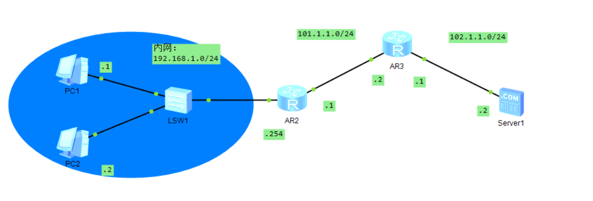

### 相关配置

AR2的配置

```
system-view  #进入全局配置
inter g0/0/0 #进入内网接口
ip address 192.168.1.254 24
inter g0/0/1 #进入公网接口
ip address 101.1.1.1 24
nat static global 101.1.1.3 inside 192.168.1.1    #需要注意的一点是静态NAT表是配置在连接公网的接口，而不是连接私网的接口
nat static global 101.1.1.4 inside 192.168.1.2 
quit
ip route-static 0.0.0.0 0.0.0.0 101.1.1.2 
```

### 进行抓包测试

在下面这个地方进行抓包

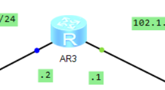

使用pc1进行ping服务器的操作

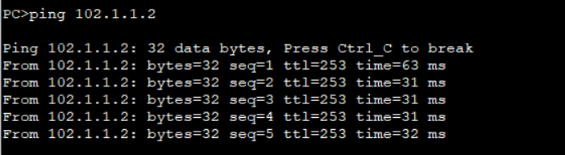


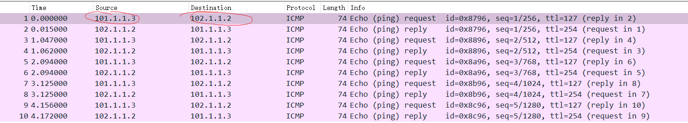

项目的相关地址：[静态NAT.topo](../../实验/静态NAT/静态NAT.topo)

## NAPT

①把二元组“内部网络主机的IP＋端口号”和“公网IP＋端口号”执行一对一绑定；

②一个公网IP地址可以同时为多个私有IP地址提供外网连接。

**NAPT (Network Address Port Translation，网络地址端口转换)** 是一种基于 **NAT (Network Address Translation，网络地址转换)** 技术的扩展，它在网络中允许多个内部设备通过共享一个公共IP地址（公网IP）与外部网络进行通信。NAPT 是一种实现 **端口级的地址转换**，它不仅通过修改源IP地址来进行映射，还修改源端口号，以便多个内部主机可以共享一个公共IP。

### NAPT的工作原理

NAPT 基本上会将多个内部主机的私有IP地址映射到一个公共的IP地址上，并且为每个连接分配一个唯一的端口号。这样，外部网络看到的都是同一个公网IP地址，但它能根据端口号将返回的数据准确地发送到正确的内部设备。

具体来说，NAPT的工作过程如下：

1. **内部设备发起连接**：
   - 内部网络中的设备（例如，`192.168.1.2`）发送数据包到外部网络。
   - 数据包的源IP地址是内部设备的私有IP（例如，`192.168.1.2`），源端口是该设备使用的本地端口（例如，`12345`）。
2. **NAT设备转换**：
   - NAPT设备（通常是路由器或防火墙）会将内部设备的私有IP地址和端口号映射到公网IP地址，并分配一个唯一的端口号（例如，`80.1.1.1:10001`）。这时，数据包的源IP会变成公网IP（例如，`203.0.113.5`），源端口会变成NAT设备为该连接分配的端口号（例如，`10001`）。
3. **外部网络响应**：
   - 外部服务器接收到数据包并响应。返回的目标IP地址是公网IP（例如，`203.0.113.5`），目标端口是NAT设备分配的端口号（例如，`10001`）。
4. **NAT设备反向转换**：
   - NAPT设备收到返回的数据包后，通过端口号来识别该数据包应该转发给哪个内部设备。它会将数据包的目标IP和端口转换回内部设备的私有IP和端口。
5. **最终传输到内部设备**：
   - 数据包被转发到内部设备（例如，`192.168.1.2`）的正确端口（例如，`12345`），内部设备可以处理该响应。

### NAPT的优势

1. **节省公网IP地址**：
   - NAPT 使得多个内部设备可以共享一个公网IP，从而极大地节省了公网IP的需求。这对于IP地址资源稀缺的场景尤其有用。
2. **增强安全性**：
   - 由于内部设备的IP地址不会直接暴露在外部网络中，NAPT 可以提高网络的安全性。外部网络只能看到公网IP地址和端口，而无法直接访问到内部设备。
3. **允许大规模连接**：
   - 通过为每个连接分配一个唯一的端口，NAPT 可以支持大量的并发连接。即使只有一个公网IP地址，也可以支持多个内部设备同时访问外部网络。

### NAPT的缺点

1. **端口限制**：
   - 因为每个连接都需要占用一个端口号，如果多个内部设备大量并发访问外部服务器，可能会遇到端口耗尽的问题，特别是在大规模应用中，端口号可能不足以支撑大量连接。
2. **影响P2P通信**：
   - NAPT 对于点对点（P2P）应用和某些协议（如 SIP、FTP）可能造成问题，因为这些协议通常需要直接访问内部设备的IP地址和端口，而NAPT会进行地址和端口的转换，可能会导致通信问题。
3. **复杂性**：
   - NAPT 配置和管理相对复杂，尤其是在涉及到 NAT 反向映射（例如，用于服务器托管的情况）时，配置错误可能导致网络无法正常工作。

### NAPT vs NAT

- **NAT**：通常指的仅仅是“网络地址转换”，它可以简单地将一个私有IP映射到一个公共IP（通常是一对一的转换）。它并不涉及端口号的转换。
- **NAPT**：则是 NAT 的一种扩展，它通过端口号的转换实现多个设备共享一个公网IP。NAPT 是 NAT 中最常用的形式，特别是在家庭和小型办公室的路由器中。

### 使用场景

1. 家庭和小型办公室网络：
   - 多台设备（如手机、电脑、平板）通过路由器共享一个公网IP地址访问互联网。
2. 企业网络：
   - 企业内部的多个主机通过企业的网关设备共享公网IP访问外部资源，同时保护内部设备的IP地址不被暴露。

### 示例

假设一个内部设备（`192.168.1.10`）使用端口 `12345` 连接到外部网站（例如，`example.com`），NAT设备（例如路由器）会将源IP地址和端口号转换为公网IP（`203.0.113.5`）和一个新的端口号（`10001`）。从外部来看，所有的请求都来自公网IP `203.0.113.5`，端口号 `10001`。

### 总结

NAPT 是一种非常实用的技术，通过端口转换实现多个内部设备共享一个公网IP，从而节省IP地址资源并提高安全性。它被广泛应用于家庭路由器、企业网关、以及需要大量并发连接的场景。

### topo图

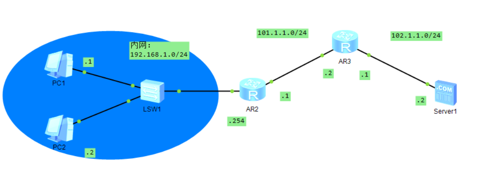

### 相关配置

AR2配置：

```
system-view #进入全局配置模式
inter g0/0/0 #进入内网接口
ip address 192.168.1.254 24
inter g0/0/1 #进入公网接口
ip address 101.1.1.1 24
quit
acl 2000   #acl 后面跟的整型 范围在 <2000,4999>
rule permit source 10.1.0.0 0.0.0.255   #这里是定义一个允许出的IP地址的规则，ip地址后面跟的是子网掩码的反码
quit
nat address-group 1 101.1.1.3 101.1.1.3   #addres-group后接的是组的index,范围是0~9，后续接的是地址池的 起始地址，和结束地址
int g0/0/1
nat outbound 2000 address-group 1
```

> - 那为啥配置的时候没有涉及到端口
>
>   - 在配置 **NAPT (Network Address Port Translation)** 时，虽然 NAPT 实际上涉及到端口号的转换，但很多时候在配置 NAT 时并不需要显式地提及端口。这是因为大多数网络设备（如路由器或防火墙）会自动为每个连接分配一个端口号，并根据连接的特性动态管理这些端口。简单来说，NAPT 在配置过程中通常是隐式地处理端口转换的
>
> - ACL匹配内网解释一下
>
>   - 在网络安全和路由中，**ACL（Access Control List，访问控制列表）** 是一种用来控制访问权限的机制，它通过定义哪些流量（基于IP地址、协议、端口等）可以进出网络设备或系统来实现访问控制。
>
>     当提到 **ACL 匹配内网** 时，通常是在讨论如何使用 ACL 来控制内网流量的访问权限，确保只有符合特定条件的流量可以进入或离开内网。下面我将详细解释这个概念。
>
>     1. **内网的定义**
>
>     - 内网（Private Network）
>
>        是指公司、组织或家庭内部使用的网络，它通常使用私有IP地址范围，例如：
>
>       - `10.0.0.0` 到 `10.255.255.255`
>       - `172.16.0.0` 到 `172.31.255.255`
>       - `192.168.0.0` 到 `192.168.255.255`
>
>     - 内网通常与外部的公网（例如互联网）进行隔离，需要通过路由器、网关或防火墙等设备来实现访问控制。
>
>     2. **ACL的基本作用**
>
>     - **控制流量**：ACL 是一种基于规则的过滤机制，它通过设定规则来决定哪些数据包被允许通过，哪些被拒绝。ACL 可以在路由器、交换机、防火墙等设备上配置。
>     - **控制访问**：根据源地址、目的地址、协议类型、端口号等条件来决定哪些流量可以进入或离开内网。
>
>     3. **如何使用 ACL 匹配内网流量**
>
>     在配置 ACL 时，你可以指定哪些内网流量被允许通过，哪些被拒绝。这里的“匹配内网”指的是对内网流量的过滤和控制，可以分为以下几种常见情况：
>
>     1. **匹配内网流量进入外网（出口过滤）**
>
>     你可以使用 ACL 来控制从内网到外网（例如互联网）的流量。例如，你可以配置一个 ACL 规则来允许内网某些IP访问外部网站，同时禁止其他IP访问外部网
>
>     3. **匹配内网流量之间的访问（内网内部流量过滤）**
>
>     除了控制内外网流量，你还可以使用 ACL 控制内网内部设备之间的访问。例如，禁止某些内网设备互相访问。
>     
>     4. **匹配内网流量时的考虑事项**
>
>     - **ACL的顺序**：ACL规则是逐条执行的，一旦某条规则匹配成功，后续规则将不再执行。因此，规则的顺序非常重要。
>    - **默认行为**：大多数网络设备上的ACL有一个“隐式拒绝”规则，即在所有规则之后默认拒绝所有流量。因此，通常需要确保明确允许的流量在ACL中被列出。
>     - **性能问题**：ACL规则的数量和复杂度可能影响设备的性能，特别是在大规模网络中。
>     - **日志记录**：在某些设备上，你可以配置ACL的日志记录功能，以便记录哪些流量被允许或拒绝，这有助于进行故障排查和安全审计。
>     
>    5. **总结**
>     
>    - **ACL匹配内网**的核心是基于访问控制规则来管理内网流量的访问，确保只有合法的流量能够进入、离开或在内网内部流动。
>     - 通过合理配置ACL，可以实现对内网流量的精确控制，保护内网不受外部威胁，同时限制内网不同部分之间的访问。
>     
>     希望这能帮助你理解ACL在内网中的匹配和应用。如果有更具体的情景或问题，随时告诉我！

### 进行抓包测试

在下面这个位置进行抓包：

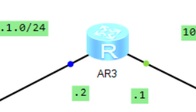

使用pc1去ping服务器

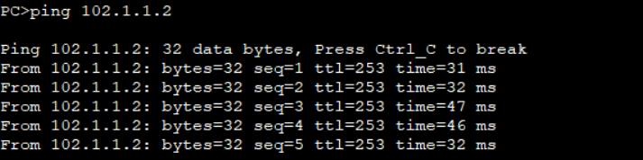


使用pc2去ping服务器

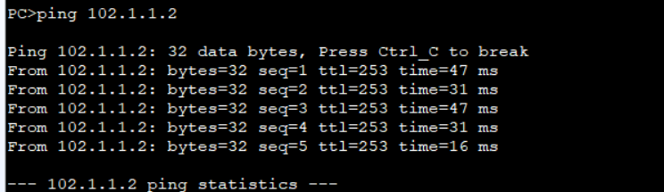


> 可以看到两种的源ip是相同的

项目的相关地址：[NAPT.topo](../../实验/NAPT/NAPT.topo)

## Easy IP

**Easy IP** 是华为针对 **NAT（Network Address Translation）** 和 **IP 地址转换** 提供的一种简化配置方式。它帮助用户在 **私有网络与公共网络** 之间进行 IP 地址转换。通过 **Easy IP**，内部网络的私有 IP 地址可以共享一个公网 IP 地址，实现多个内部设备共享一个公网 IP 地址的效果。

### **Easy IP 的核心功能：**

1. **NAT 及端口映射**：
   - 通过 Easy IP，内部设备的私有 IP 地址和端口可以映射到一个公网 IP 地址上，多个内部设备可以通过同一个公网 IP 地址访问外部网络。这是典型的 **NAPT（Network Address Port Translation）** 功能。
2. **简化配置**：
   - **Easy IP** 提供了一种简化的 NAT 配置方法，用户不需要手动配置每个 NAT 地址池或映射关系，可以通过简洁的命令快速实现内外网的 IP 地址转换。
3. **动态 IP 映射**：
   - Easy IP 可以动态分配公网 IP 地址，自动进行地址转换。用户可以设置设备的 NAT 行为，使设备通过一个公网 IP 地址同时处理多个内网设备的流量。
4. **适应网络拓扑变化**：
   - 设备的 **公网 IP** 会自动和动态地进行切换或更新，确保即使公网 IP 地址发生变化时，Easy IP 也能自动进行相应的转换，保证内网设备的连接不受影响。

### **Easy IP 的工作原理：**

- **私网 IP 到公网 IP 映射**：当内网设备发起外部请求时，Easy IP 会通过公网 IP 地址进行 **地址转换**，并将私网的 IP 地址转换为公网 IP 地址，以便内网设备能够与外部设备进行通信。
- **端口复用**：多个内网设备可以共享同一个公网 IP 地址，不同的设备会使用不同的端口号进行通信，从而实现通过一个公网 IP 同时支持多个内网设备访问外部网络的功能。

### **Easy IP 与传统 NAT 区别：**

- **传统 NAT**：通常需要手动配置 NAT 地址池，并为每个内网设备分配一个公网 IP 或通过端口映射进行管理。
- **Easy IP**：简化了 NAT 配置，自动进行公网 IP 地址的管理，能够快速配置和启用多个设备共享一个公网 IP 地址。

### **Easy IP 适用场景**

- **企业分支机构**：多个分支通过 VPN 等方式连接到总部网络时，Easy IP 可以确保内网设备通过总部的公网 IP 地址访问互联网。
- **ISP 网络**：用于多个客户共享有限的公网 IP 地址，减少公网 IP 地址的消耗。
- **家庭路由器**：在一些家庭路由器中，Easy IP 可用于实现 **NAT 转换**，使多个家庭设备通过一个公网 IP 访问互联网。

### **总结**

**Easy IP** 是一种 **简化的 NAT 技术**，专门用于 **多个内部设备共享一个公网 IP 地址** 的场景。它提供了自动化的 IP 地址转换和端口映射配置，简化了配置和管理，提高了大规模网络环境下的操作效率。

### topo图

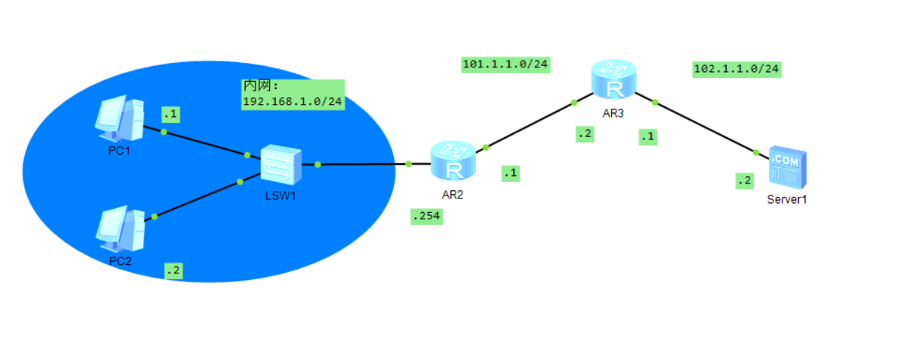

### 相关配置

```
system-view
acl 2000
rule permit source 192.168.1.0 0.0.0.255
quit
inter g0/0/1
nat outbound 2000
```

### 进行抓包测试

在下面这个位置进行抓包：


使用pc1去ping服务器

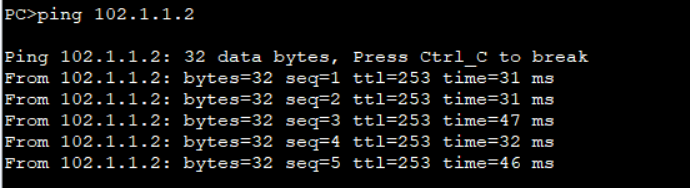

使用pc2去ping服务器

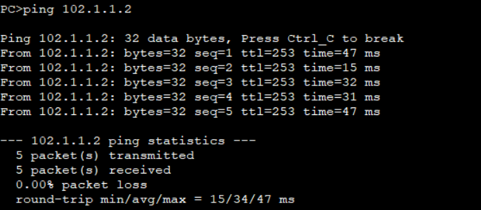


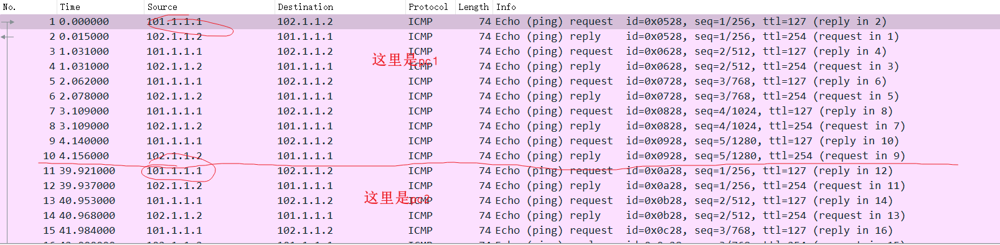

> 可以看到源都是AR2的g0/0/1上的ip地址

项目的相关地址：[Easy IP.topo](../../实验/Easy IP/Easy IP.topo)

## NAT服务器


### topo图


### 相关配置


### 进行抓包测试