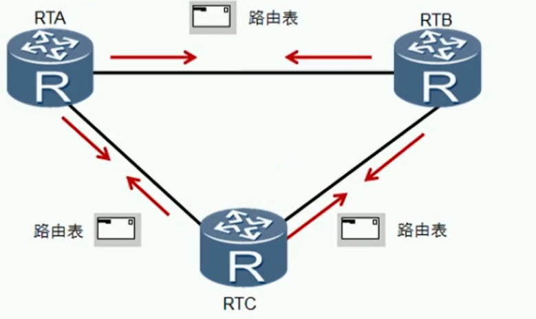

## RIP（routing information Protocol）路由信息协议

> 它是基于距离矢量算法的协议，使用跳数作为度量来衡量到达目的网络的距离。RIP主要用于规模较小的网络中

特点：

- 配置简单
- 易于维护
- 适合小型网络

> - 距离矢量路由协议，属于IGP协议
> - 适用于中小型网络，有RIPv1和RIPv2两个版本
> - 基于UDP,目标端口号520
> - 周期性更新 （大致30s）
> - 支持水平分割、毒性逆转和触发更新等防环措施特性

## RIP工作原理

​	

> 路由器运行RIP后，会首先发送路由更新请求，收到请求的路由器会发送自己的RIP路由进行相应

### RIP度量

​	

> - RIP使用跳数作为度量值来衡量到达目的网络的距离
> - 缺省情况下，**直连网络的路由跳数为0**，当路由器发送路由更新时，会把度量值加1
> - RIP规定超过15跳为网络不可达

当Metric=16的时候就证明网络不可达

## 缺点

慢：更新周期在30s

​	

不够聪明：开销只取决于跳数，没有考虑到带宽，链路拥堵问题
